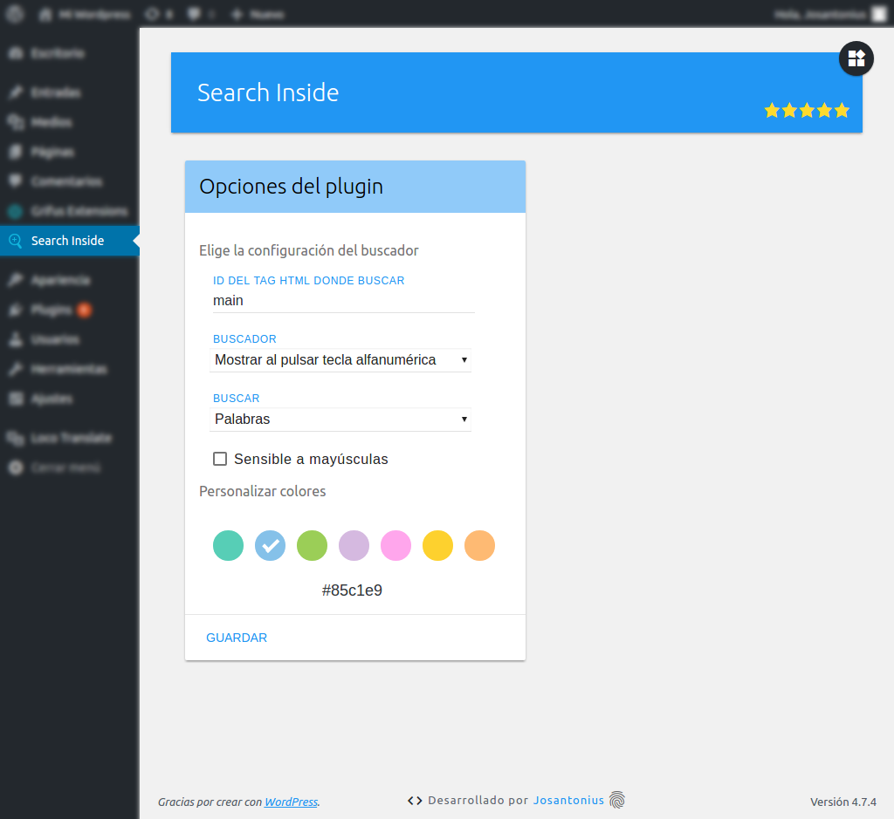
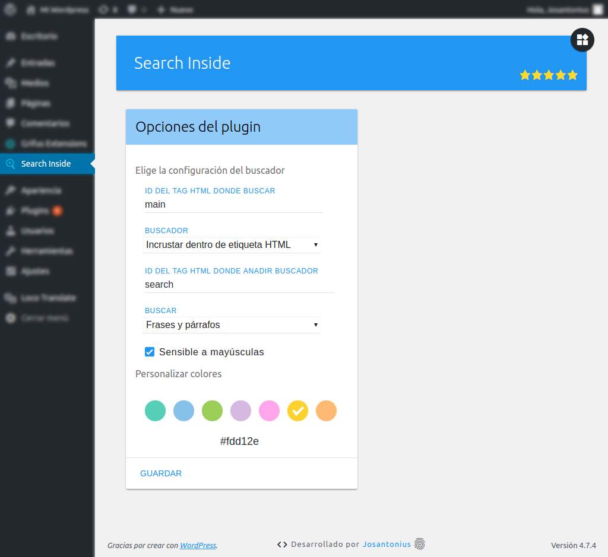
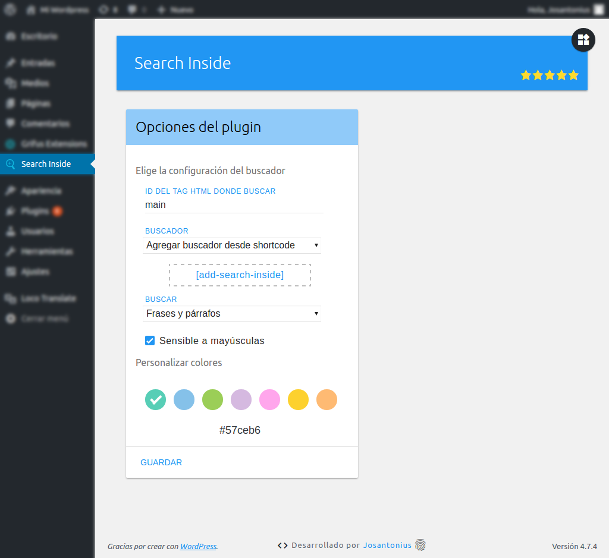
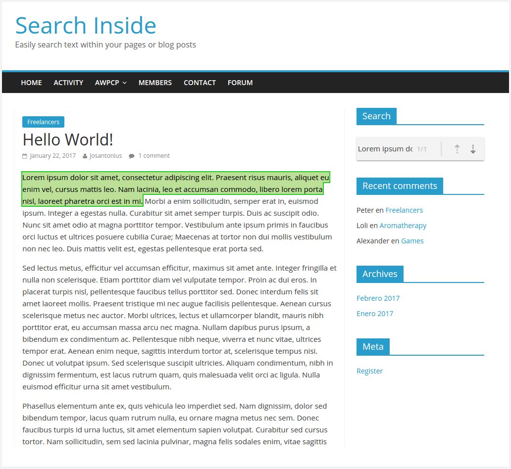

# Search Inside Wordpress Plugin

   

[English version](README.md)

Busca y remarca fácilmente frases o palabras en páginas y entradas.

---

- [Instalación](#instalación)
- [Requisitos](#requisitos)
- [Imágenes](#imagenes)
- [Contribuir](#contribuir)
- [Copyright](#copyright)
- [Licencia](#licencia)

---

Con Search Inside ahora puedes realizar búsquedas dentro de tus publicaciones o páginas en WordPress.

** Hay diferentes formas de mostrar el Buscador **

- El motor de búsqueda aparece cuando se pulsa cualquier tecla alfanumérica.

- Incrustrado en una etiqueta HTML.

- Insertarlo desde shortcode.

** Dos modos de búsqueda **

- Buscar frases completas.

- Buscar palabras separadas por espacios.

¡No olvides activar el modo sensible a mayúsculas y minúsculas si lo necesitas!

### Instalación 

Puedes instalar este plugin desde el [repositorio oficial](https://es.wordpress.org/plugins/search-inside/) en WordPress.

Utilizando [Composer](http://getcomposer.org/download/). En la carpeta raíz de WordPress ejecutar:

    $ composer require josantonius/search-inside

Desde el panel de administración de WordPress:

	1. Entra en 'Plugins > Añadir Nuevo'
	2. Busca 'Search Inside'
	3. Activa Search Inside en tu página de plugins.

Desde WordPress.org:

	1. Descarga [Search Inside](https://es.wordpress.org/plugins/search-inside/).
	2. Sube el directorio 'search-inside' a tu directorio '/ wp-content / plugins /', usando tu método favorito (ftp, sftp, scp, etc ...).
	3. Activa Search Inside en tu página de plugins.

Una vez activado:

	Entra en 'Search Inside > Opciones' para configurar el plugin.
    
### Requisitos

Este plugin es soportado por versiones de PHP 5.3 o superiores y es compatible con versiones de HHVM 3.0 o superiores.

### Imágenes

### Contribuir
1. Comprobar si hay incidencias abiertas o abrir una nueva para iniciar una discusión en torno a un fallo o función.
1. Bifurca la rama del repositorio en GitHub para iniciar la operación de ajuste.
1. Escribe una o más pruebas para la nueva característica o expón el error.
1. Haz cambios en el código para implementar la característica o reparar el fallo.
1. Envía pull request para fusionar los cambios y que sean publicados.

Esto está pensado para proyectos grandes y de larga duración.

### Copyright

2017 Josantonius, [josantonius.com](https://josantonius.com/)

Si te ha resultado útil... ¡házmelo saber! Sígueme en [Twitter](https://twitter.com/Josantonius).

### Licencia

Este proyecto está licenciado bajo la **licencia GPLv2**. Consulta el archivo [LICENSE](license/LICENSE) para más información.