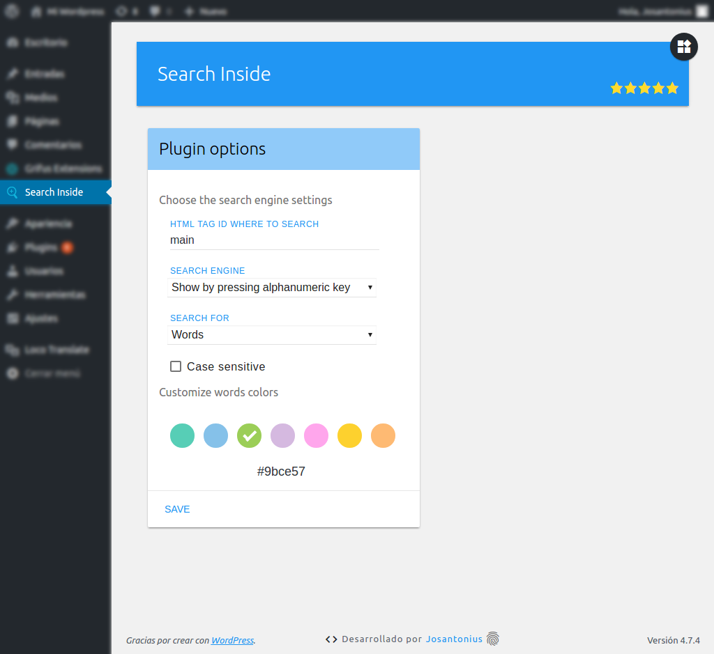
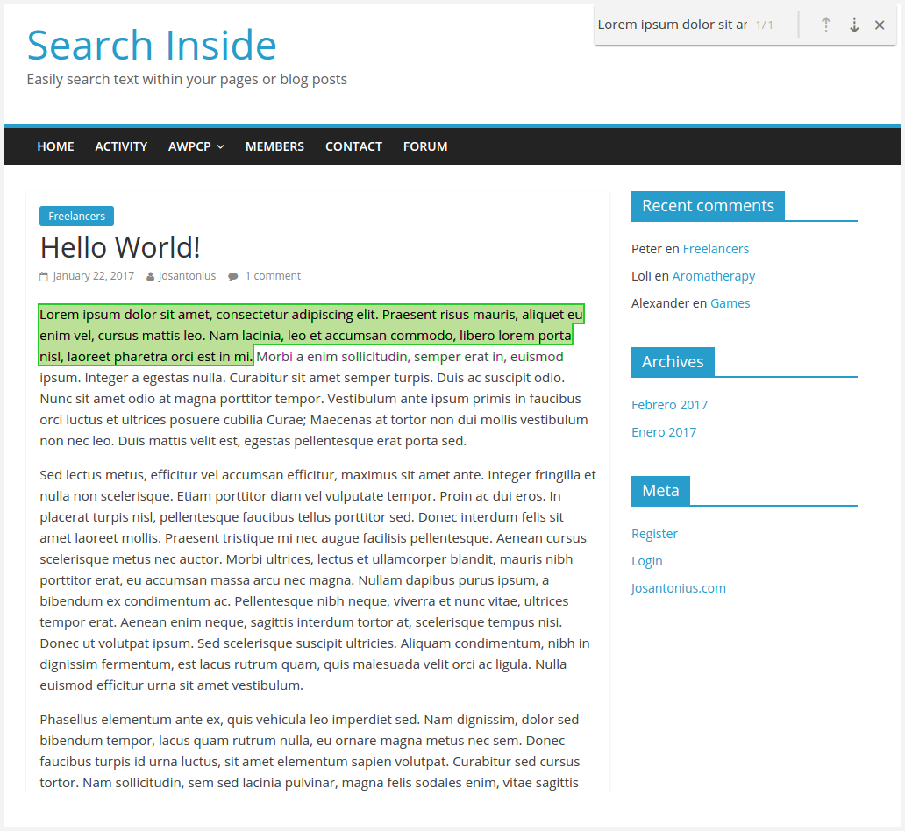

# Search Inside Wordpress Plugin

   

[Versión en español](README-ES.md)

Easily search text within your pages or blog posts.

)

---

- [Installation](#installation)
- [Requirements](#requirements)
- [Images](#images)
- [Contribute](#contribute)
- [Copyright](#copyright)
- [Licensing](#licensing)

---

With Search Inside now you can search within your posts or pages. 

**There are different ways to display the search engine**

- The search engine appears when you press any alphabetic or numeric key.

- Appended on a HTML tag.

- Inserted from a shortcode.

**Two search modes**

- Look for complete sentences.

- Search words separated by spaces. 

Don't forget to turn on case sensitive mode if you need it!

### Installation

You can download this plugin from the [official repository](https://es.wordpress.org/plugins/search-inside/) in WordPress.

From [Composer](http://getcomposer.org/download/).

    $ composer require josantonius/search-inside

From your WordPress dashboard:

	1. Visit 'Plugins > Add New'
	2. Search for 'Search Inside'
	3. Activate Search Inside from your Plugins page.

From WordPress.org:

	1. Download [Search Inside](https://es.wordpress.org/plugins/search-inside/).
	2. Upload the 'search-inside' directory to your '/wp-content/plugins/' directory, using your favorite method (ftp, sftp, scp, etc...).
	3. Activate Search Inside from your Plugins page.

Once Activated:

	Visit 'Search Inside > Options' to configure the plugin.

### Requirements

This pluggin is supported by PHP versions 5.3 or higher and is compatible with HHVM versions 3.0 or higher.

### Images

### Contribute
1. Check for open issues or open a new issue to start a discussion around a bug or feature.
1. Fork the repository on GitHub to start making your changes.
1. Write one or more tests for the new feature or that expose the bug.
1. Make code changes to implement the feature or fix the bug.
1. Send a pull request to get your changes merged and published.

This is intended for large and long-lived objects.

### Copyright

2017 Josantonius, [josantonius.com](https://josantonius.com/)

If you found this release useful please let the author know! Follow on [Twitter](https://twitter.com/Josantonius).

### Licensing

This project is licensed under **GPLv2 license**. See the [LICENSE](license/LICENSE) file for more info.